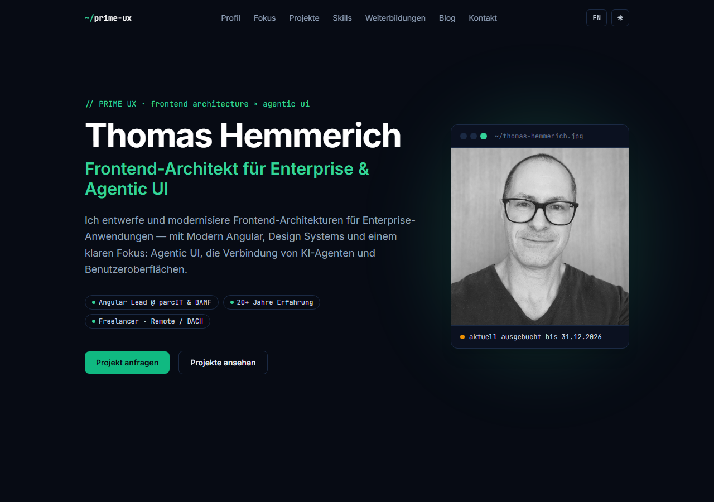

# prime-ux.de

> Persönliche Website von **Thomas Hemmerich** — Frontend-Architekt & Angular Lead.

[](https://github.com/themmerich/prime-ux-ai/actions/workflows/ci.yml)


[](LICENSE)

**Live:** [prime-ux.de](https://prime-ux.de)

[](https://prime-ux.de)

Die Seite ist bewusst kein Template, sondern ihr eigenes Showcase: modernes Angular ohne Altlasten, statisch ausgeliefert, vollständig als Infrastruktur-Code betrieben — und ohne eine einzige Tracking-Zeile.

## Highlights

- **Zoneless Angular 22** — Change Detection ausschließlich über Signals, kein Zone.js, Standalone Components.
- **Static Site Generation** — jede Route wird zu fertigem HTML prerendert (`outputMode: "static"`) und im Browser hydratisiert. Im Betrieb läuft kein Node-Server.
- **Zweisprachigkeit als Datenmodell** — Signal-basiertes i18n (DE/EN); Inhalte liegen als typisierte `L<T>`-Objekte vor, nicht als externe Translation-Files.
- **Infrastructure as Code** — die komplette AWS-Umgebung (S3, CloudFront, Route 53, ACM, Budget) ist als Terraform versioniert.
- **Sicherheit & Qualität in CI** — jeder Pull Request durchläuft Build, `terraform validate` und einen Trivy-Scan (Vuln, Secret, Misconfig).
- **Kein Tracking, keine Cookies** — selbst gehostete Fonts, keine Third-Party-Requests.
- **SEO & Feeds out of the box** — `sitemap.xml` und RSS-Feeds (DE/EN) werden beim Build erzeugt.

## Tech-Stack

| Bereich        | Eingesetzt                                            |
| -------------- | ----------------------------------------------------- |
| Framework      | Angular 22 (zoneless, Signals, Standalone Components)  |
| Sprache        | TypeScript                                             |
| Styling        | Tailwind CSS 4                                         |
| Rendering      | Prerendering / SSG (`@angular/ssr`, `outputMode: static`) |
| Infrastruktur  | Terraform → AWS (S3, CloudFront, Route 53, ACM)        |
| CI/CD          | GitHub Actions (Trivy, Terraform, Build, Deploy)      |

## Rendering

Der Build prerendert jede Route zu fertigem HTML, das anschließend im Browser hydratisiert wird. Es läuft kein Node-Server — der Output bleibt eine Sammlung statischer Dateien für S3 + CloudFront.

Zwei Dinge folgen daraus:

- Artikeltexte werden als Markdown zur Buildzeit ins Bundle gezogen (esbuild-`text`-Loader, siehe `angular.json`), damit sie im prerenderten HTML stehen.
- Ausgeliefert wird deutsches HTML; der Sprachumschalter tauscht die Texte nach der Hydration im Browser.

## Entwicklung

Voraussetzung: Node 22.

```bash
npm install
npm start        # Dev-Server auf http://localhost:4200 (rendert serverseitig vor)
npm test         # Unit-Tests (Vitest)
npm run build    # Produktions-Build + Prerendering nach dist/prime-ux/browser
```

Der `build`-Schritt erzeugt zusätzlich `sitemap.xml` sowie die RSS-Feeds `rss.xml` (DE) und `rss.en.xml` (EN) — siehe `scripts/`.

## Struktur

```
src/app/
├── sections/            One-Page-Sektionen der Startseite (hero, about, focus, …)
├── pages/               Home, Impressum, Datenschutz
├── blog/                Blog-Liste, -Post und -Karten
├── core/                Signal-basierte Services: i18n, Theming, SEO
├── data/                content.ts (Seiteninhalt) · blog.ts + blog-posts.json (Artikel)
├── shared/              wiederverwendbare UI-Bausteine
└── app.routes.server.ts welche Routen prerendert werden (inkl. Blog-Slugs)

src/content/blog/        Artikeltexte als Markdown (<slug>.<lang>.md)
scripts/                 Build-Nachlauf: Sitemap- und RSS-Generierung
infra/                   komplette AWS-Infrastruktur als Terraform
.github/workflows/       CI (PR-Checks) und Deployment
```

Der gesamte Seiteninhalt liegt als typisiertes, zweisprachiges Datenmodell in `src/app/data/content.ts` — die Komponenten rendern nur, sie halten keine Texte.

## Deployment

Jeder Push auf `main` deployt automatisch nach AWS: Trivy → Terraform → Build → S3 → CloudFront-Invalidierung. Details und einmaliges Bootstrap: [infra/README.md](infra/README.md).

## Roadmap

- [ ] Agentischer Assistent (Phase 2)

Bereits umgesetzt: AWS-Hosting & -Deployment via Terraform, RSS-Feeds für den Blog (DE/EN).

## Lizenz

Veröffentlicht unter der [MIT-Lizenz](LICENSE). Der Quellcode darf frei verwendet werden; Inhalte, Texte und Markenzeichen (Name, Logo, Portrait) sind davon ausgenommen.
